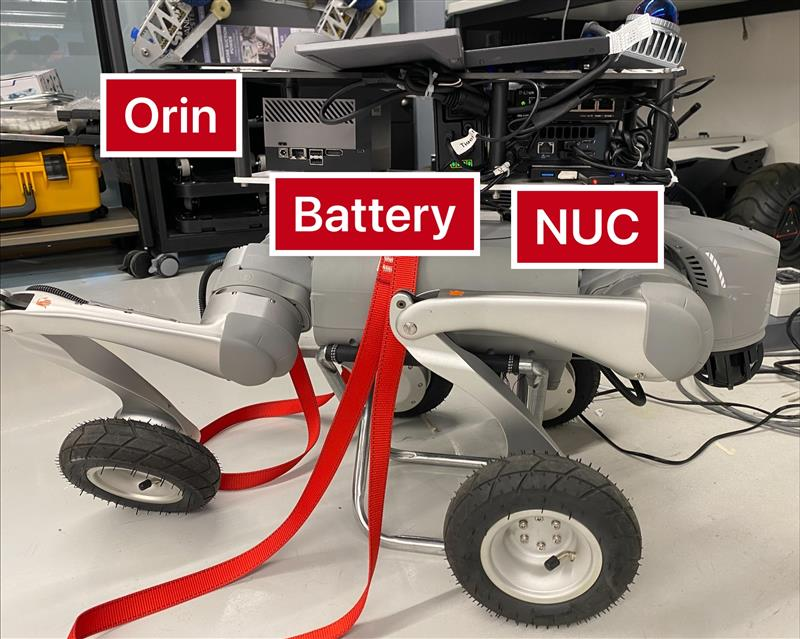
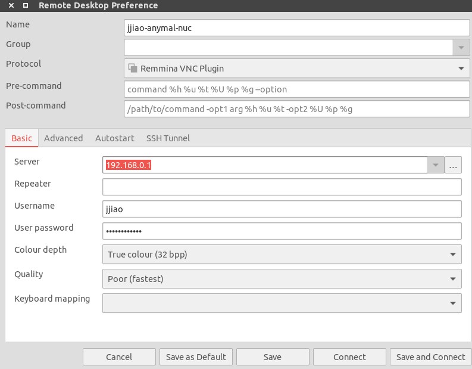

## Run Program On Go2W with the CMU Navigation System

### Start Hardware
1. Connect the bettery with the NUC and Jetson Orin.
2. Login the **jjiao** account with the password.
3. Check whether the NUC is connected to the GO2W.
4. Turn on the Go2W.
5. Run ```./start_vnc.sh``` on both the NUC and Jetson, you can use the Remmina to remotely control them.
<div align="center">
  <a href="">
    
  </a> 
</div>

### Start VNC
1. (NUC/Jetson) settings -> sharing -> scene sharing (turn on)
2. (User PC) open Remmina Remote Destkop -> create a VNC setting -> click connect
3. **Note**: if you cannot connect to the NUC, please check the wifi setting of NUC, whether the network to the GO2W is connected
<div align="center">
  <a href="">
    
  </a> 
</div>

### Start Sensor
1. Setup sensor on the NUC (start Livox, publish TF): 
   ```
   cd ~/robohike_ws/src/RPL-RoboHike/config_launch_go2w
   ./run_nuc_go2w_sensor_setup.sh
   ```

2. Setup sensor on the Jetson (start Zed camera): 
   ```
   cd ~/robohike_ws/src/RPL-RoboHike/config_launch_go2w
   ./run_orin_go2w_sensor_setup.sh
   ```

3. Open RVIZ on the NUC to check whether the zed camera already setup

   ```
   rviz -d config_launch_anymal/rviz_cfg/zed.rviz
   ```

4. Check whether sensor data is ready:

   ``````
   rostopic hz /livox/imu
   ``````

5. Record ROS bag (**navigation_debug.sh** only records raw data, while **navigation.sh** records raw data and navigation data)

   ``````
   cd ~/
   ./record_rosbag_go2w_navigation_debug.sh
   ``````

### RUN the Fastlio2

1. Setup cmu navigation:
   ```
   docker start robohike_anymal
   docker exec -it robohike_anymal /bin/bash
   cd /Titan/robohike_ws/src/RPL-RoboHike/config_launch_go2w
   ./run_fastlio2_mid360.sh
   ```
   A rviz will open and visualize message

<!-- TODO -->
### RUN the CMU Navigtion System (Not TEST)

1. Setup cmu navigation:
   ```
   cd ~ && ./run_nuc_go2w_real_system.sh
   roslaunch config_launch_go2w/launch/cmu_exploration/go2w_real_system.launch
   ```
   A rviz will open and visualize message
2. Use the [Game Joystick](image/joystick_esm9013_description.png) and click the ```start``` button, you can see message in the terminal
   ```
   [Navigation Control] Will republish velocity to /motion_reference/command_twist message
   ```
   This means that your joystick is taking the control
3. Provide a waypoint and Press ```auto mode``` to let the robot autonomouslymove
4. [Emergency] Use the GO2W joystick to avoid any danger, and recover ```auto mode``` by pressing the ```start``` button with the game joystick.
