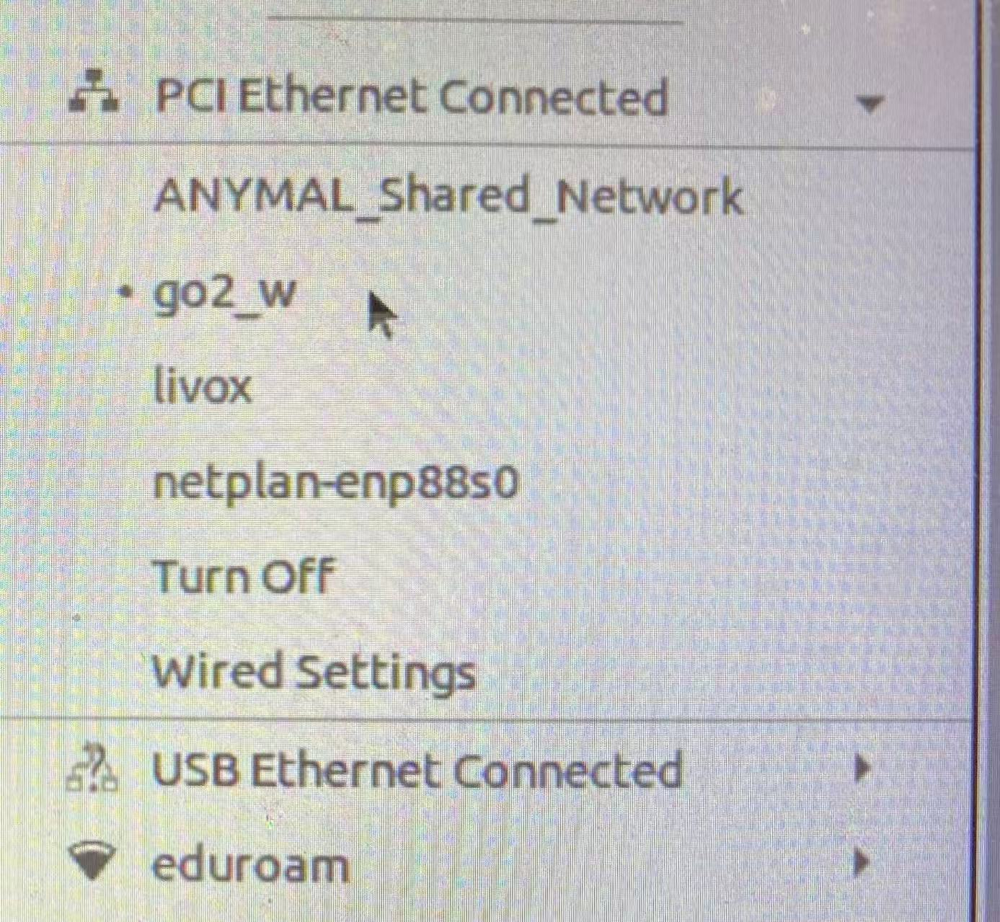
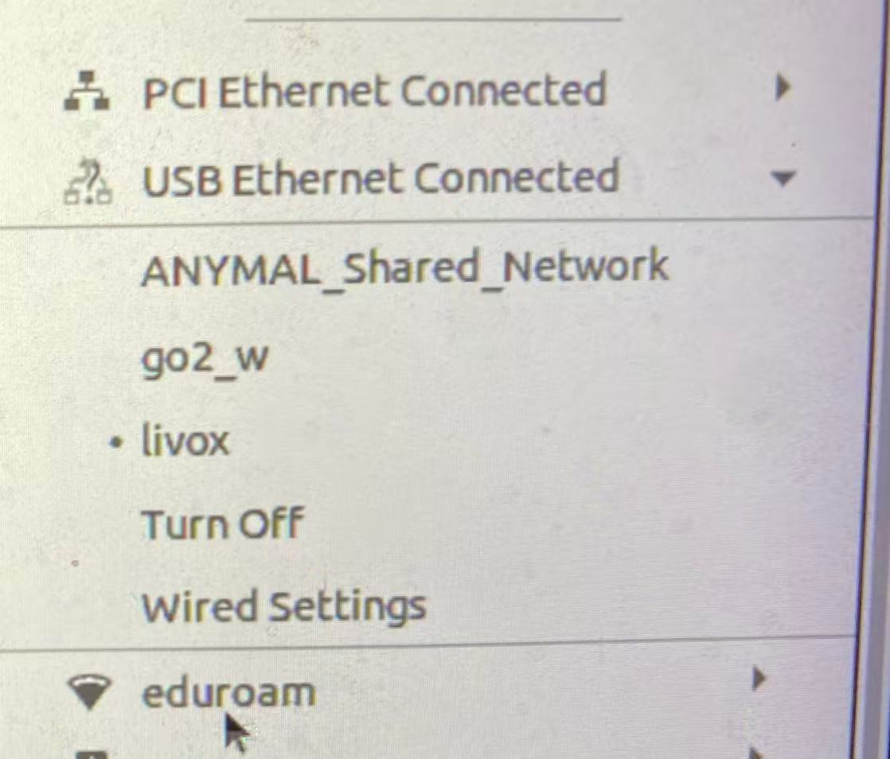
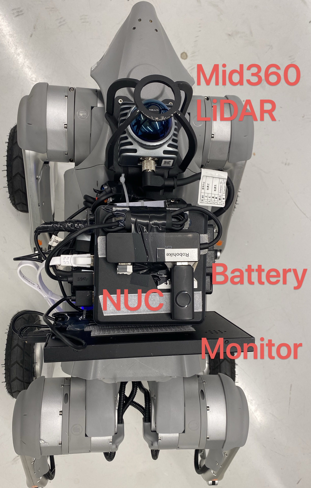
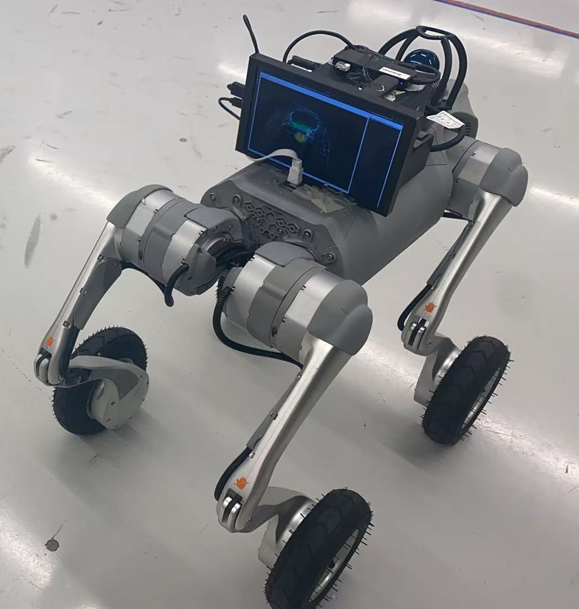
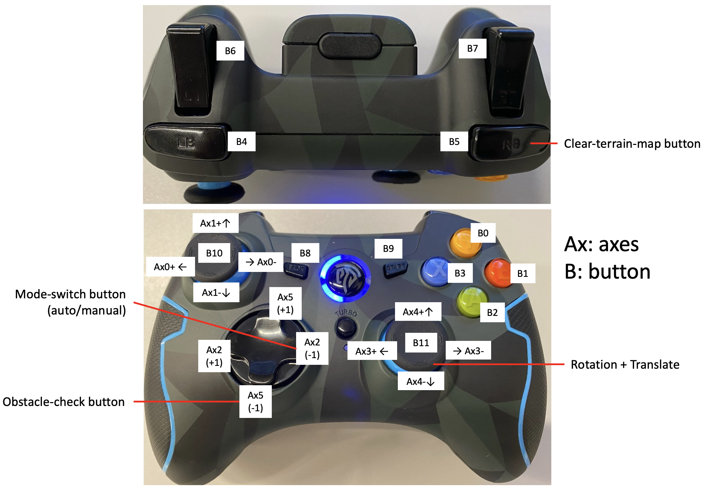

This README provides instructions on how to install and configure the ROS bridge for message conversion between ROS 1 and ROS 2, specifically for the Unitree ROS2 Toolkits, and start the CMU navigation on the GO2W robot.

### 1\. Installing Requirements

#### 1.1 Install ROS2
Full documentation is [here](https://docs.ros.org/en/foxy/Installation/Ubuntu-Install-Debians.html). 
Please check the corresponding ROS2 version for your perference.

#### 1.2. ROS 1 Bridge
Full documentation is [here](https://github.com/ros2/ros1_bridge/blob/master/README.md).

1.  Navigate to the `ros2_ro1_bridge_ws` source directory and clone the `ros1_bridge` repository.

    ```shell
    cd robohike_ws/src/ros2_ros1_bridge_ws/src
    git clone https://github.com/ros2/ros1_bridge -b foxy
    cd ../
    ```

2.  Build all packages *except* the `ros1_bridge`. It is recommended not to have your ROS 1 environment sourced during this step.

    ```shell
    colcon build --symlink-install --packages-skip ros1_bridge
    ```

3.  Finally, build only the `ros1_bridge`:

    ```shell
    source /opt/ros/noetic/setup.bash
    source /opt/ros/foxy/setup.bash
    colcon build --symlink-install --packages-select ros1_bridge --cmake-force-configure
    ```

#### 1.3. Unitree ROS2 Toolkits

First, replace `foxy` with the correct ROS2 distribution (e.g., `humble`).

1.  Navigate to your workspace and clone the Unitree ROS2 repository:

    ```shell
    cd robohike_ws/src/ros2_ws
    git clone https://github.com/unitreerobotics/unitree_ros2
    ```

2.  Install necessary tools and update packages:

    ```shell
    apt install gedit net-tools -y
    apt update && apt install ros-foxy-rmw-cyclonedds-cpp ros-foxy-rosidl-generator-dds-idl -y
    ```

3.  Clone and build CycloneDDS:

    ```shell
    cd unitree_ros2/cyclonedds_ws/src/
    git clone https://github.com/ros2/rmw_cyclonedds -b foxy
    git clone https://github.com/eclipse-cyclonedds/cyclonedds -b releases/0.10.x
    cd ../
    colcon build --packages-select cyclonedds
    ```

4.  Source the ROS 2 setup and build the Unitree ROS2 packages:

    ```shell
    source /opt/ros/foxy/setup.bash
    colcon build --symlink-install
    ```

##### 1.4. Unitree GO2 Bringup

remove ```go2_simulation``` and ```go2_nav```

```
apt install ros-foxy-xacro
colcon build --symlink-install
```

```
ros2 launch go2_bringup go2w_robot.launch.py
```

### 2\. Start G2W

#### 2.1. Network Configuration

1.  Connect the robot and the onboard NUC computer/your own computer with a network cable. Please check the connection

<p align="center">
    
</p>

<p align="center">
    
</p>


2.  Verify the connection by pinging the robot's IP address:

    ```shell
    ping 192.168.123.99
    ```

3.  Modify the `robohike_ws/src/unitree_ros2/setup.sh` file with the following content.

    **Note:** Replace `eno2` with the name of your computer's network card.

    ```bash
    #!/bin/bash
    echo "Setup unitree ros2 environment"
    source /opt/ros/humble/setup.bash
    source robohike_ws/src/unitree_ros2/cyclonedds_ws/install/setup.bash
    export RMW_IMPLEMENTATION=rmw_cyclonedds_cpp
    export CYCLONEDDS_URI='<CycloneDDS><Domain><General><Interfaces>
                           <NetworkInterface name="eno2" priority="default" multicast="default" />
                           </Interfaces></General></Domain></CycloneDDS>'
    ```

### 3\. Setup GO2W

#### Hardware
<p align="center">
    
</p>

<p align="center">
    
</p>

#### Software
Start the VNC on the NUC computer, you can use the Remmina to remote control them.
```shell
./start_vnc.sh
```

Setup sensor drivers:
```shell
cd ~ && bash run_nuc_go2w_hd_setup.sh
```

Run the following script to start the sensor and ros1 bridge:

```shell
cd ~ && bash run_nuc_go2w_sensor_setup.sh
```

### 4\. Run the CMU Navigtion System

1. Setup cmu navigation:
   ```shell
   cd ~ && bash run_nuc_go2w_real_system.sh
   roslaunch config_launch_go2w/launch/cmu_exploration/go2w_real_system.launch use_rviz:=true
   ```
   A rviz will open and visualize message
2. Use the [Game Joystick](image/joystick_esm9013_description.png) and click the ```start``` button, you can see message in the terminal
   <p align="center">
     
   </p>

   ```shell
   [Navigation Control] Start Publishing Twist message.
   ```
   
   This means that your joystick is taking the control
3. Provide a waypoint and Press ```auto mode``` to let the robot autonomously move
4. [Emergency] Use the GO2W joystick to avoid any danger, and recover ```auto mode``` by pressing the ```start``` button with the game joystick.


### Report Issue
1. Complie ```ros1_bridge```: if you have encoutered this issue
```shell script
--- stderr: ros1_bridge                                          
/usr/bin/ld: libros1_bridge.so: undefined reference to `ros1_bridge::Factory<controller_manager_msgs::ControllerState_<std::allocator<void> >, controller_manager_msgs::msg::ControllerState_<std::allocator<void> > >::convert_1_to_2(controller_manager_msgs::ControllerState_<std::allocator<void> > const&, controller_manager_msgs::msg::ControllerState_<std::allocator<void> >&)'
```
Please remove ```/opt/ros/foxy/share/controller_manager_msgs``` and re-compile
```shell script
colcon build --symlink-install --packages-select ros1_bridge --cmake-force-configure
```

2. If you cannot successfully build the ros1-bridge, please reinstall the ros1 and re-complie it again
