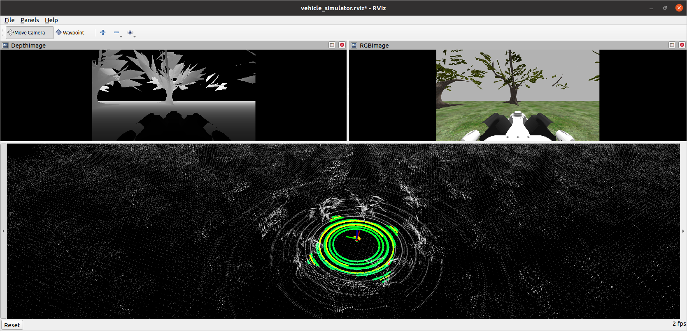

# rpl-go-1

This is a ros package to use the Go1 robot with RoboHike. It doesn't yet work, this is still in development.



## Quick Start
```
catkin build rpl-unitree-ros
source devel/setup.bash
roslaunch rpl-unitree-ros system_forest.launch
```

## Attribution

The robot models all came from Unitree's ros repo on github [here](https://github.com/unitreerobotics/unitree_ros). This was not easy to submodule as the repo itself isn't a meta ros package.

## Troubleshooting

### Spawn service failed

Error:

```
[ERROR] [1735467490.197852, 2972.804000]: Spawn service failed. Exiting.
[spawn_camera-7] process has died [pid 8269, exit code 1, cmd /opt/ros/noetic/lib/gazebo_ros/spawn_model -urdf -param /camera_description -model rgbd_camera __name:=spawn_camera __log:=/home/student/.ros/log/2fa2dda2-c5ce-11ef-829e-cd6a884391bb/spawn_camera-7.log].
log file: /home/student/.ros/log/2fa2dda2-c5ce-11ef-829e-cd6a884391bb/spawn_camera-7*.log
```

Why: if you are running on a computer with limited CPU it may have failed the timeout. You can check error message by looking at logs:

```
cat /home/student/.ros/log/2fa2dda2-c5ce-11ef-829e-cd6a884391bb/spawn_camera-7*.log
```
```
[INFO] [1735467490.196398, 2972.804000]: Spawn status: SpawnModel: Entity pushed to spawn queue, but spawn service timed out waiting for entity to appear in simulation under the name rgbd_camera
```

Solution:
ignore the error. This gazebo spawn service will process the spawn request in time, even after the spawn node times out and fails it will still be in the queue. You should still see the camera come up and be able to navigate.